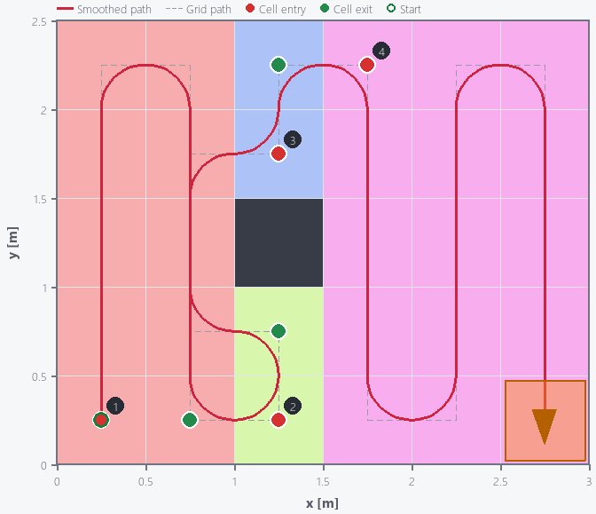
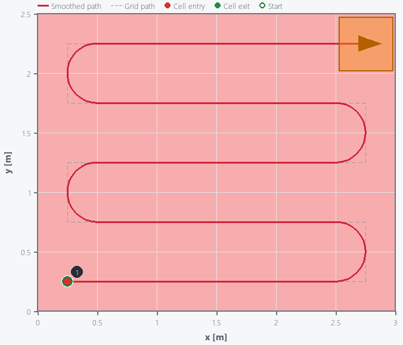
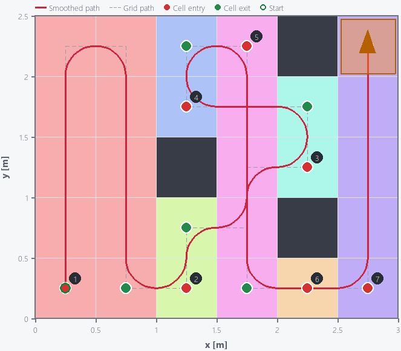

# GA 기반 Coverage Path Planning (TSP-CPP)

그리드 맵 위에서 장애물을 배치하고, **사다리꼴(Boustrophedon) 셀 분해 → TSP-CPP 유전 알고리즘 → A\* 연결 → 곡률 제약 스무딩** 순서로
에이전트(로봇)의 커버리지 경로를 계획하는 인터랙티브 도구입니다. 계산된 경로는 일정 간격의 웨이포인트로 Excel 파일에 저장할 수 있습니다.

<p align="center">
  
</p>

## 파이프라인

1. **셀 분해** (`decomposition.py`) — 좌→우로 컬럼을 스윕하며 장애물 없는 구간의 연결 관계가 바뀌는 지점마다 새 셀을 만드는 그리드 기반 사다리꼴 분해.
2. **TSP-CPP GA** (`tsp_cpp_ga.py`) — 셀 방문 순서와 각 셀의 진입/이탈 조합을 하나의 GA로 동시에 최적화 (Tung & Liu, 2019 재구현).
   - 결합 유전자 인코딩 `cell_id * 8 + choice`, 룰렛휠 선택, heuristic crossover, swap mutation
   - 방문 순서가 고정되면 최적 진입/이탈 조합을 DP로 계산 (논문 Algorithm 1)
   - 셀 내부 스윕: 세로/가로 2방향 × 코너 4개 = 8가지 조합
   - 셀 간 전이 비용은 장애물을 고려한 A\* 경로 길이 사용
3. **경로 연결** (`astar.py`) — 인접하지 않은 이탈점→진입점 구간을 4방향 A\*로 이어붙임.
4. **곡률 제약 스무딩** (`path_smoothing.py`) — 모든 모서리를 최소 회전반경 `r_min` 이하의 접선 원호(fillet)로 둥글려 곡률 ≤ 1/r_min, G1 연속 경로 생성 (Höffmann et al., 2023의 스무딩 목표를 닫힌 형태로 구현).

## 설치

Python 3.10 이상에서 동작합니다 (3.13에서 테스트).

```bash
pip install -r requirements.txt
```

## 실행

```bash
python main.py
```

| 조작 | 동작 |
| --- | --- |
| 좌클릭 / 드래그 | 장애물 생성·제거 |
| **Decompose** | 셀 분해 결과를 색으로 표시 |
| **Clear** | 장애물 및 결과 초기화 |
| **Save / Load** | 장애물 배치를 `map/*.json`으로 저장·불러오기 |
| **Coverage Path** | GA → A\* → 스무딩 실행 후 에이전트 이동 애니메이션 표시 |
| **Save Path** | 스무딩된 경로를 `path/path_<timestamp>.xlsx`로 저장 |

`map/`, `path/` 폴더는 실행 시 자동으로 생성됩니다.

## 설정

모든 파라미터는 `main.py` 상단에서 변경합니다.

| 변수 | 기본값 | 설명 |
| --- | --- | --- |
| `MAP_WIDTH_M`, `MAP_HEIGHT_M` | 3.0, 2.5 | 작업 공간 크기 (m) |
| `AGENT_SIZE_M` | 0.5 | 에이전트 크기 = 그리드 한 칸 크기 D (m) |
| `START_POS` | 왼쪽 아래 | 경로 시작 칸 (row, col) |
| `MIN_TURN_RADIUS_M` | 0.3 | 최소 회전반경 r_min (m) |
| `PATH_POINT_SPACING_M` | 0.025 | Save Path 시 웨이포인트 간격 (m) |
| `GA_PARAMS` | — | 개체 수, 세대 수, 교차/돌연변이 확률, elite 수, 조기 종료 patience, 회전 페널티, seed |

## 출력 형식 (`path/*.xlsx`)

실행 중 생성되는 XLSX 파일은 로컬 산출물이며 Git 저장소에는 포함하지 않습니다.

- `path` 시트: `index`, `x_m`, `y_m`, `dist_along_path_m` — 왼쪽 아래 원점, y축 위쪽 증가
- `meta` 시트: 맵 크기, 셀 크기, 점 간격, 점 개수, 전체 경로 길이

## 프로젝트 구조

```
.
├── main.py             # 진입점 및 파라미터 설정
├── grid_map.py         # pygame 기반 맵 에디터 / 시각화 / 저장
├── decomposition.py    # 사다리꼴(Boustrophedon) 셀 분해
├── cells.py            # 셀 자료구조
├── tsp_cpp_ga.py       # TSP-CPP 유전 알고리즘
├── astar.py            # 그리드 A* 및 경로 연결
├── path_smoothing.py   # 곡률 제약 원호 스무딩 및 리샘플링
├── figure/             # 결과 스크린샷 예시
└── path/               # 저장된 경로 예시 (xlsx)
```

## 결과 예시

| obs_0 | obs_1 | obs_3 |
| --- | --- | --- |
|  |  |  |

## 참고 문헌

- W.-C. Tung and J.-S. Liu, "Solution of an Integrated Traveling Salesman and Coverage Path Planning Problem by Using a Genetic Algorithm with Modified Operators," *IADIS International Journal on Computer Science and Information Systems*, 14(2), pp. 95–114, 2019. — 참조 구현: [WJTung/GA-TSPCPP](https://github.com/WJTung/GA-TSPCPP)
- M. Höffmann, S. Patel, and C. Büskens, "Optimal Coverage Path Planning for Agricultural Vehicles with Curvature Constraints," *Agriculture*, 13(11), 2112, 2023.
